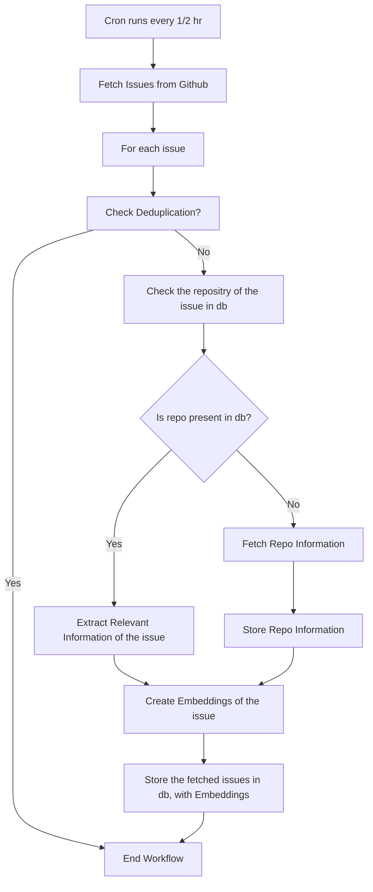
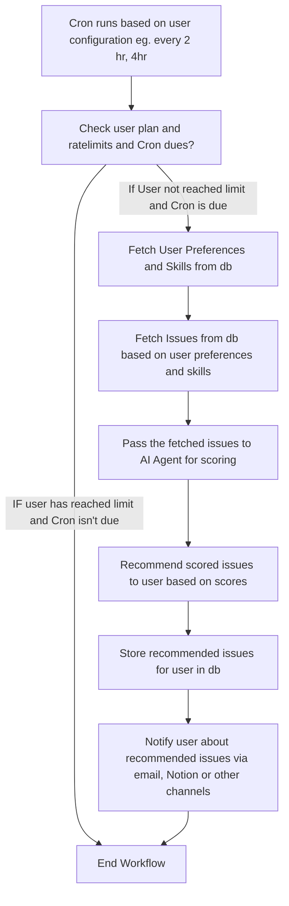

# Agentic Workflows Architecture

# Workflow 1: Issues Ingestion 
This workflow will ingest issues from Github to database and create embedding of the issues and it extract the relevant information repos and store in database. This workflow will be triggered by cron-job(every 1/2 hour)

Workflow Steps:
1. **Ingest Issues**: Fetch issues from Github repositories using the Github API using smart search queries.
2. **Store the fetched issues**: Store the fetched issues in a database.
3. **Extract Relevant Information**: Extract relevant information from the issues such as title, description, labels, and comments, and repo information such as languages, repo name, and other metadata. 
4. **Create Embeddings**: Create embeddings of the extracted information (combined) of the issue. to facilitate semantic search and retrieval.
5. **Store Embeddings**: Store the created embeddings in the db.
6. **Check the repo of the issue in db**: Check if the repo of the issue is already present in the database. If not, trigger the repo ingestion workflow
7. **Fetch Repo Information**: If the repo is not present in the database, fetch the repo information using the Github API. extract relevant information such as repo name, description, languages, stars, forks, and other metadata(last issue opened, last pr raised on).
8. **Store Repo Information**: Store the fetched repo information in the database.

# Flow: 

# Workflow 2: User Specific Agent Runs
This workflow will fetch the issues semantically from the database based on user skills and preferences, and then those fetched issues will be passed to the AI Agent to score the issues based on the user skills and preferences. then issues will be recommended to user based on score. This workflow will be triggered by cron-job(based on user configuration)

Workflow Steps:
1. **Fetch User Preferences**: Fetch user preferences and skills from the database.
2. **Fetch Issues**: Fetch issues from the database based on user preferences and skills using semantic search.
3. **Score Issues**: Pass the fetched issues to the AI Agent to score the issues based on user preferences and skills.
4. **Recommend Issues**: Recommend the scored issues to the user based on the scores.
5. **Store User Recommendations**: Store the recommended issues for the user in the database for future reference and tracking.
6. **Notify User**: Notify the user about the recommended issues via email, Notion or other notification channels based on user preferences.

# Flow: 

**Note**: There also constraints and ratelimits on the number of issues to be recommended to the user based on user plan.(free, pro, premium). The workflow will check the user plan and recommend issues accordingly.
It will check the user plan first, then based on that proceed for this workflow to recommend issues to the user. If the user has reached the limit of recommended issues, it will not recommend any more issues to the user until the next cycle.